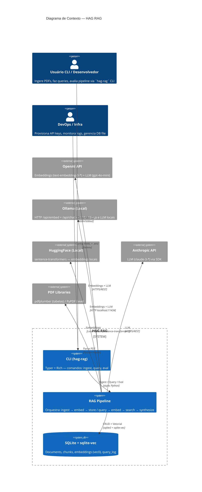
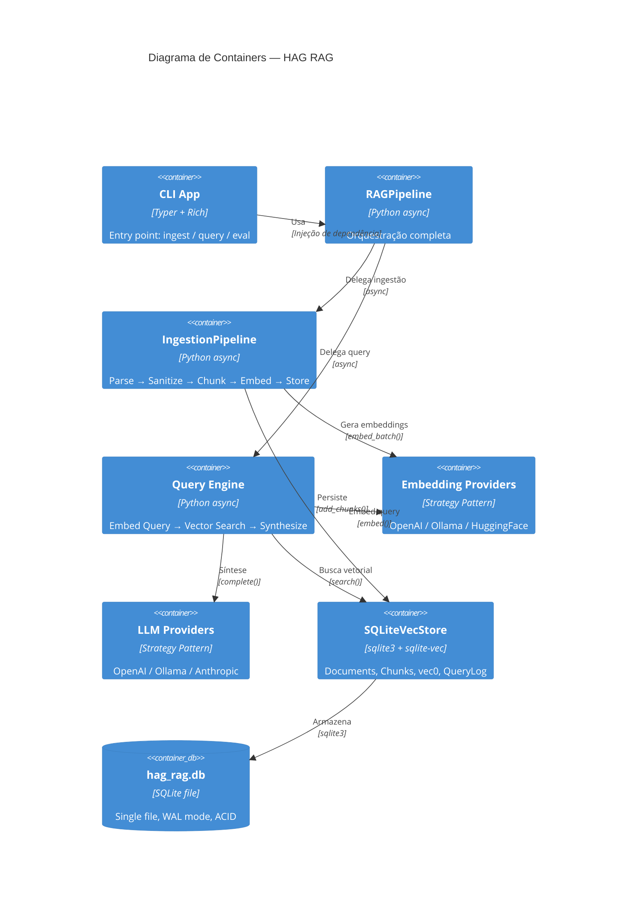
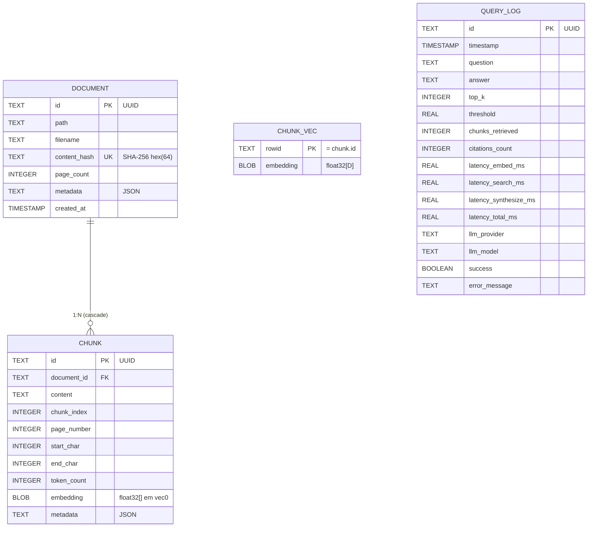

# Arquitetura: HAG RAG (Projeto HAG 2)

> Gerado pelo Reversa Architect em 2026-09-22
> Nível de documentação: **essencial** (C4 Contexto + ERD embutidos)

---

## 1. Visão Geral

**HAG RAG** é um pipeline **RAG (Retrieval-Augmented Generation)** local-first para ingestão de PDFs, geração de embeddings, busca vetorial e síntese de respostas com citações. Arquitetura modular, baseada em **Strategy Pattern** para provedores intercambiáveis, com **SQLite + sqlite-vec** como store unificado.

### Características Principais

| Aspecto | Detalhe |
|---------|---------|
| **Paradigma** | Pipeline batch (ingest) + request-response (query) |
| **Linguagem** | Python 3.11+ |
| **Framework CLI** | Typer + Rich |
| **Configuração** | Pydantic Settings v2 (YAML + env + secrets) |
| **Vector Store** | SQLite + sqlite-vec (virtual table `vec0`) |
| **Embeddings** | OpenAI / Ollama / HuggingFace (Strategy) |
| **LLM** | OpenAI / Ollama / Anthropic (Strategy) |
| **Parsing PDF** | pdfplumber (rico) / PyPDF (fallback) |
| **Chunking** | Tokens (tiktoken) ou chars, sliding window + overlap |
| **Síntese** | Strict grounding + few-shot defense + citações `[N]` |
| **Observabilidade** | JSON logging + request_id + query_log table |

---

## 2. Diagrama C4 — Contexto (Nível 1)



### Atores e Sistemas Externos

| Ator/Sistema | Tipo | Protocolo | Finalidade |
|--------------|------|-----------|------------|
| Usuário CLI | Pessoa | stdin/stdout | Operação direta |
| DevOps | Pessoa | File/env | Configuração e secrets |
| OpenAI API | SaaS | HTTPS/REST | Embeddings + LLM (cloud) |
| Ollama | Local | HTTP/REST | Embeddings + LLM (local, privacidade) |
| HuggingFace | Local | Python lib | Embeddings (local, offline) |
| Anthropic | SaaS | HTTPS/REST | LLM (cloud, alternativo) |
| pdfplumber/PyPDF | Lib | Python import | Extração texto+tabelas / fallback |

---

## 3. Diagrama C4 — Containers (Nível 2)



### Containers e Tecnologias

| Container | Tecnologia | Responsabilidade |
|-----------|------------|------------------|
| CLI App | Typer + Rich | Interface humana, progress bars, tabelas, JSON output |
| RAGPipeline | Python async | Facade: inicializa providers, coordena ingest/query/eval |
| IngestionPipeline | Python async | Parse PDF → sanitize → chunk → embed_batch → store |
| Query Engine | Python async | embed(query) → search(top_k, threshold) → synthesize |
| Embedding Providers | Strategy + Registry | OpenAI (AsyncOpenAI+tenacity), Ollama (httpx), HF (sentence-transformers) |
| LLM Providers | Strategy + Registry | OpenAI (AsyncOpenAI), Ollama (SSE), Anthropic (SDK) |
| SQLiteVecStore | sqlite3 + sqlite-vec | Virtual table `vec0` para busca cosseno nativa |
| hag_rag.db | SQLite file | Persistência única, portável, ACID |

---

## 4. ERD — Entidade-Relacionamento (Resumo)



### Tabelas Principais

| Tabela | Chave Primária | Chaves Estrangeiras | Índices | Finalidade |
|--------|----------------|---------------------|---------|------------|
| `documents` | `id` (UUID) | — | `idx_documents_hash` (content_hash UNIQUE) | Metadados do documento ingerido |
| `chunks` | `id` (UUID) | `document_id` → documents(id) ON DELETE CASCADE | `idx_chunks_document_id` | Metadados do chunk (sem embedding) |
| `chunks_vec` | `rowid` (= chunk.id) | — | Virtual table `vec0` | Embeddings para busca vetorial nativa |
| `query_log` | `id` (UUID) | — | `idx_query_log_timestamp` | Observabilidade: latência, provider, sucesso |

### Relacionamentos

- **Document 1 : N Chunk** — Cascade delete (remover doc apaga chunks + vec rows)
- **Chunk 1 : 1 Chunk_Vec** — `rowid` = `chunk.id` (ligação implícita)
- **QueryLog** — Independente, apenas observabilidade

---

## 5. Componentes Principais (Visão Lógica)

```
hag_rag/
├── config.py              # AppConfig (Pydantic Settings) — YAML + env + secrets
├── logging.py             # JSON logging + request_id (contextvars)
├── pipeline/
│   └── orchestrator.py    # RAGPipeline — facade ingress/query/eval
├── domain/
│   ├── models.py          # Document, Chunk, QueryResult, Configs (Pydantic)
│   └── exceptions.py      # Hierarquia HAGRAGException → 6 especializadas
├── utils/
│   └── text.py            # SHA256, sanitize, tiktoken, chunk_by_tokens/chars
├── ingestion/
│   ├── parser.py          # PDFParser ABC + PdfPlumberParser + PyPDFParser + factory
│   ├── chunker.py         # Chunker (tokens/chars, overlap, page_estimation)
│   └── pipeline.py        # IngestionPipeline (orchestra parse→store)
├── embeddings/
│   ├── base.py            # EmbeddingProvider ABC + EmbeddingConfig
│   ├── openai.py          # OpenAIEmbeddingProvider (AsyncOpenAI + tenacity)
│   ├── ollama.py          # OllamaEmbeddingProvider (httpx /api/embed)
│   ├── huggingface.py     # HuggingFaceEmbeddingProvider (sentence-transformers lazy)
│   └── __init__.py        # Registry + create_embedding_provider()
├── vector_store/
│   ├── base.py            # VectorStore ABC + Chunk dataclass
│   ├── sqlite_vec.py      # SQLiteVecStore (vec0, query_log, cascade delete)
│   └── __init__.py        # Registry + create_vector_store()
├── synthesis/
│   ├── llm.py             # LLMProvider ABC + LLMConfig + LLMResponse
│   ├── openai_llm.py      # OpenAILLMProvider (streaming + tiktoken)
│   ├── ollama_llm.py      # OllamaLLMProvider (SSE /api/chat)
│   ├── anthropic_llm.py   # AnthropicLLMProvider (SDK messages.create)
│   ├── prompt.py          # SYSTEM_PROMPT (strict grounding) + FEW_SHOT defense
│   ├── synthesizer.py     # RAGSynthesizer (filter→prompt→llm→extract citations)
│   └── __init__.py        # Registry + create_llm_provider()
└── cli/
    ├── cli.py             # Typer app (ingest/query/eval)
    ├── cli_ingest.py      # Progress bar, table/JSON output
    ├── cli_query.py       # Markdown panel, citations table, latency
    └── cli_eval.py        # Health checks + vector stats + config dump
```

---

## 6. Integrações Externas

| Integração | Protocolo | Autenticação | Config | Uso |
|------------|-----------|--------------|--------|-----|
| **OpenAI Embeddings** | HTTPS/REST (`/v1/embeddings`) | Bearer token (API Key) | `EMBEDDING__API_KEY_ENV`, `EMBEDDING__BASE_URL` | `embed_batch()` nativo, retry tenacity |
| **OpenAI LLM** | HTTPS/REST (`/v1/chat/completions`) | Bearer token | `LLM__API_KEY_ENV`, `LLM__BASE_URL` | `complete()` + `complete_stream()` |
| **Ollama Embeddings** | HTTP (`/api/embed`) | Nenhuma (local) | `EMBEDDING__BASE_URL` (default localhost:11434) | Batch nativo, model dims map |
| **Ollama LLM** | HTTP SSE (`/api/chat`) | Nenhuma | `LLM__BASE_URL` | Streaming nativo |
| **HuggingFace Embeddings** | Local (sentence-transformers) | Nenhuma | `EMBEDDING__MODEL` (ex: `BAAI/bge-m3`) | Lazy load, batch ST nativo |
| **Anthropic LLM** | HTTPS/REST (`/v1/messages`) | Bearer token (API Key) | `LLM__API_KEY_ENV`, `LLM__BASE_URL` | System prompt separado, streaming |
| **pdfplumber** | Python import | — | `parser: "pdfplumber"` | Texto + tabelas |
| **PyPDF** | Python import | — | `parser: "pypdf"` | Fallback leve (só texto) |

---

## 7. Dívidas Técnicas Identificadas

| ID | Descrição | Severidade | Localização |
|----|-----------|------------|-------------|
| TD-001 | **Dimensions embedding↔store não validadas** — `embedding.dimensions` pode ≠ `vector_store.embedding_dimensions` | 🔴 Crítica | `config.py`, `vector_store/sqlite_vec.py` |
| TD-002 | **Scores de busca não expostos** — `VectorStore.search` retorna `Chunk` sem score; orchestrator usa placeholder `[1.0]` | 🟡 Alta | `vector_store/base.py`, `pipeline/orchestrator.py` |
| TD-003 | **Dedup não verifica hash antes de parse** — Comentário "em produção usar índice de hash" | 🟡 Alta | `ingestion/pipeline.py:95` |
| TD-004 | **Página estimada heurística** — `_estimate_page_number` por offset falha em chunks cross-page | 🟡 Média | `ingestion/chunker.py:103` |
| TD-005 | **Sem transação atômica cross-table** — `add_chunks` faz commit único; falha parcial = estado inconsistente | 🟡 Média | `vector_store/sqlite_vec.py:187` |
| TD-006 | **Config duplicada** — `EmbeddingConfig` em `domain/models.py` + `config.py` + `embeddings/base.py` | 🟡 Média | 3 arquivos |
| TD-007 | **Chunk dataclass duplicado** — `vector_store/base.py` + `domain/models.py` | 🟢 Baixa | 2 arquivos |
| TD-008 | **Sem testes automatizados** — Nenhum `test_*.py` encontrado | 🔴 Crítica | Projeto inteiro |
| TD-009 | **Health check síncrono no eval** — Bloqueia event loop; ok para CLI, não para server | 🟡 Média | `cli_eval.py`, providers |
| TD-010 | **Regex citações frágil** — `\[(\d+)\]` falha se LLM usar formato diferente | 🟡 Média | `synthesis/synthesizer.py:67` |

---

## 8. Matriz de Impacto (Resumo)

| Componente | Afeta | Impactado Por |
|------------|-------|---------------|
| `AppConfig` | Todos providers, pipeline, CLI | YAML, .env, CLI args |
| `RAGPipeline` | Ingest, Query, Eval | Config, Providers injetados |
| `IngestionPipeline` | Documents, Chunks, Embeddings, Store | Parser, Chunker, Embedder, VectorStore |
| `Query Engine` | QueryResult, Latência | Embedder, VectorStore, LLM, Synthesizer |
| `EmbeddingProvider` | Chunk embeddings, Query embedding | Config (model, dimensions, batch) |
| `LLMProvider` | Síntese, Citações, Tokens | Config (model, temp, max_tokens) |
| `VectorStore` | Persistência, Busca, QueryLog | Schema (dimensions), SQLite file |
| `Chunker` | Tamanho/qualidade chunks | Config (size, overlap, unit) |
| `Parser` | Qualidade texto extraído | Config (parser type) |
| `Synthesizer` | Resposta final, Citações | LLM, Prompt config, Chunks recuperados |

---

## 9. Decisões Arquiteturais (ADRs)

| ADR | Título | Status |
|-----|--------|--------|
| 001 | SQLite + sqlite-vec como Vector Store | Aceito |
| 002 | Strategy + Registry para Providers | Aceito |
| 003 | Strict Grounding + Citações + Few-Shot Defense | Aceito |
| 004 | Chunking por Tokens + Sliding Window + Overlap | Aceito |
| 005 | Pydantic Settings v2 (YAML + Env + API Keys) | Aceito |

---

## 10. Pontos de Atenção para Evolução

1. **Mudança de modelo de embedding** → Requer recriar `hag_rag.db` (dimensions fixas no `vec0`)
2. **Escala >100k chunks** → Considerar migração para Qdrant/Chroma/pgvector
3. **Multi-tenancy** → Atual schema não suporta; adicionar `tenant_id` em todas tabelas
4. **Autenticação/Autorização** — Sistema assume single-tenant trusted
5. **Streaming end-to-end** — `query_stream()` não implementado (apenas `complete_stream` no LLM)
6. **Testes** — Prioridade: contract tests para ABCs, integration tests para pipeline