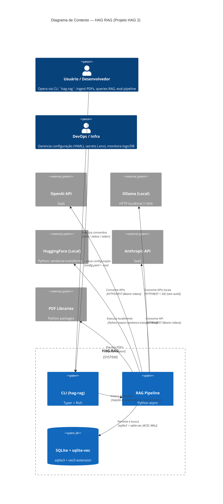

# C4 — Contexto: HAG RAG

> Diagrama C4 Nível 1 — Contexto do Sistema
> Gerado pelo Reversa Architect em 2026-09-22

---

## Legenda

| Elemento | Descrição |
|----------|-----------|
| **Person** | Ator humano (usuário final, DevOps) |
| **System** | Aplicação de software (CLI, Pipeline) |
| **SystemDb** | Armazenamento de dados (SQLite + sqlite-vec) |
| **System_Ext** | Sistema externo (APIs, bibliotecas) |
| **Rel** | Relacionamento com protocolo/tecnologia |

---

## Narrativa

O **HAG RAG** é um sistema **local-first** de *Retrieval-Augmented Generation* operado primariamente via **CLI**. O usuário (desenvolvedor/analista) ingere documentos PDF, que são parseados, chunkados, embeddados e armazenados em um banco **SQLite com extensão vetorial nativa (sqlite-vec)**. Queries são transformadas em embeddings, buscadas por similaridade de cosseno no banco, e sintetizadas por um **LLM** com **ancoragem estrita** e **citações numéricas**.

O sistema suporta **três modos de operação** para embeddings e LLM:
- **Cloud (OpenAI, Anthropic)** — melhor qualidade, custo por token, requer API key
- **Local (Ollama)** — privacidade total, roda em localhost:11434, modelos abertos
- **Local Offline (HuggingFace)** — 100% offline, `sentence-transformers`, apenas embeddings

A configuração é **declarativa** via YAML + variáveis de ambiente (`.env`), com resolução segura de secrets. Observabilidade nativa via **JSON logging com request_id** e **query_log table** com latência por etapa.