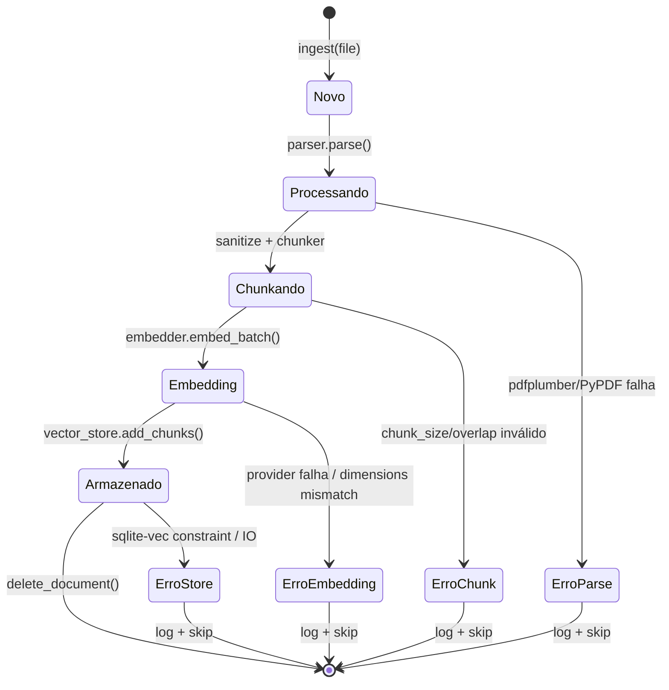
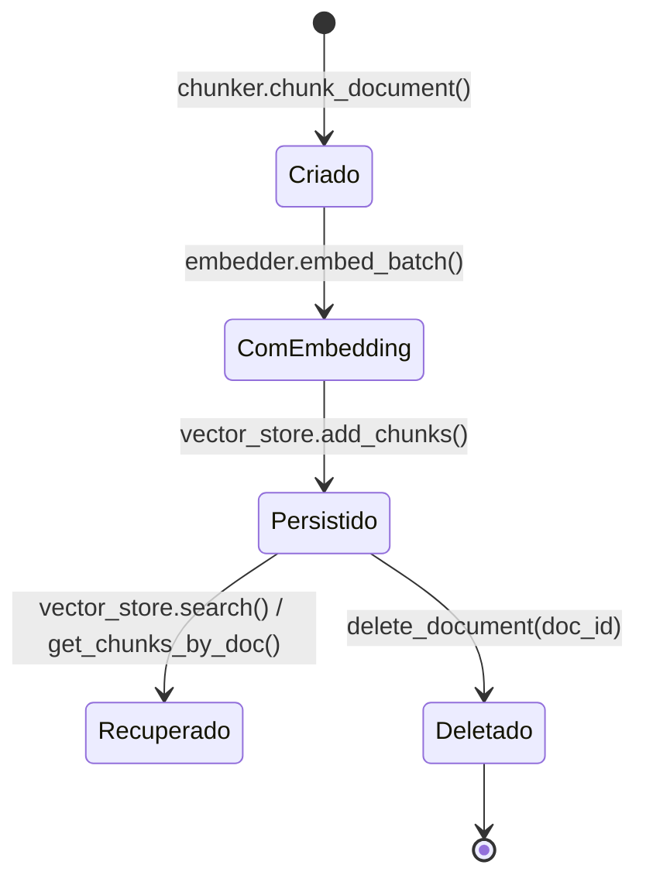
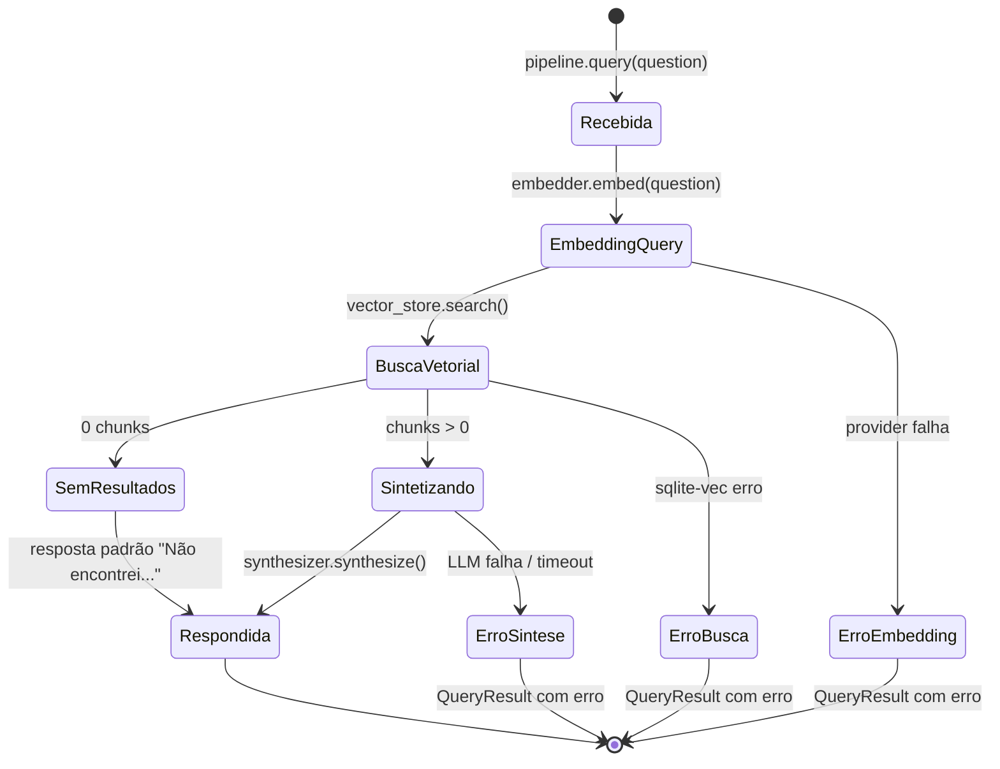
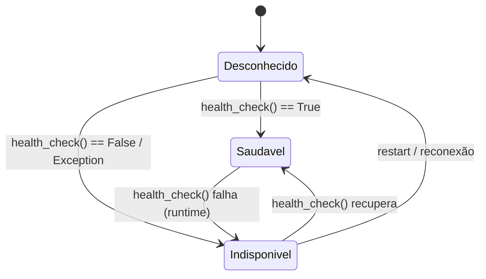

# Máquinas de Estado: HAG RAG

> Extraído pelo Reversa Detective em 2026-09-22
> Nível de documentação: **essencial** (entidades centrais com múltiplos status)

---

## 1. Document — Ciclo de Vida do Documento Ingerido

### Estados

| Estado | Descrição | Gatilho de Entrada | Gatilho de Saída |
|--------|-----------|-------------------|------------------|
| `Novo` | Arquivo descoberto, hash calculado | `ingest([path])` | `parser.parse()` sucesso |
| `Processando` | PDF sendo parseado (texto + tabelas) | Parse iniciado | `sanitize_text()` + `chunker.chunk_document()` |
| `Chunkando` | Texto dividido em chunks com metadados | Chunks criados | `embedder.embed_batch(chunks)` |
| `Embedding` | Geração de vetores em lote | Embeddings solicitados | `vector_store.add_chunks(chunks_com_embedding)` |
| `Armazenado` | Documento + chunks persistidos no SQLite | `add_chunks` retorna count > 0 | `delete_document(doc_id)` ou fim de vida |
| `ErroParse` | Falha na extração do PDF | Exceção no parser | Log + documento pulado |
| `ErroChunk` | Parâmetros de chunking inválidos | `ValueError` no Chunker | Log + documento pulado |
| `ErroEmbedding` | Falha na API de embedding / dimensions mismatch | `EmbeddingGenerationException` | Log + documento pulado |
| `ErroStore` | Falha no SQLite / sqlite-vec | `VectorStoreException` | Log + documento pulado |

### Transições e Regras

| De → Para | Condição | Ação |
|-----------|----------|------|
| `Novo → Processando` | Arquivo existe, é PDF | `parser.parse(path)` |
| `Processando → Chunkando` | Páginas extraídas (len > 0) | `sanitize_text(full_text)` → `chunker.chunk_document()` |
| `Chunkando → Embedding` | Chunks criados (len > 0) | `await embedder.embed_batch(texts)` |
| `Embedding → Armazenado` | Embeddings válidos (dimensions OK) | `await vector_store.add_chunks(chunks)` |
| `Armazenado → *` | `delete_document(doc_id)` | Cascade delete chunks + vec rows + doc se órfão |
| Qualquer → Erro* | Exceção capturada | `stats.errors.append()`, `documents_skipped++`, continua próximo arquivo |

### Observações

- **Deduplicação**: Verificação de `content_hash` ocorre *antes* do estado `Novo` (no `_ingest_single`), mas implementação atual é simplificada (comentário "em produção usar índice de hash")
- **Transacionalidade**: Cada arquivo é processado independentemente; falha em um não afeta outros
- **Rollback**: Não há transação atômica cross-table; `add_chunks` faz `commit` ao final; falha parcial deixa estado inconsistente (🔴 LACUNA)

---

## 2. Chunk — Ciclo de Vida do Fragmento

### Estados

| Estado | Descrição |
|--------|-----------|
| `Criado` | Texto + metadados (index, page, offsets, tokens), sem embedding |
| `ComEmbedding` | Embedding vetorial anexado (`chunk.embedding = List[float]`) |
| `Persistido` | Linha em `chunks` + row em `chunks_vec` virtual table |
| `Recuperado` | Retornado por busca vetorial ou `get_chunks_by_doc` |
| `Deletado` | Removido via cascade delete |

### Transições

| De → Para | Gatilho |
|-----------|---------|
| `Criado → ComEmbedding` | `embed_batch` sucesso |
| `ComEmbedding → Persistido` | `add_chunks` insere metadata + virtual table |
| `Persistido → Recuperado` | `search(query_embedding, top_k)` ou `get_chunks_by_doc(doc_id)` |
| `Persistido → Deletado` | `delete_document(doc_id)` (CASCADE) |

---

## 3. Query — Execução de Consulta RAG

### Estados

| Estado | Descrição | Latência Medida |
|--------|-----------|-----------------|
| `Recebida` | Query validada, config resolvida | — |
| `EmbeddingQuery` | Geração de embedding da pergunta | `latency_ms.embed` |
| `BuscaVetorial` | `vec_distance_cosine` top-k + threshold | `latency_ms.search` |
| `SemResultados` | 0 chunks acima do threshold | — |
| `Sintetizando` | LLM completion com chunks + few-shot | `latency_ms.synthesize` |
| `Respondida` | `QueryResult` completo com answer, citations, chunks_used, scores, latency | `latency_ms.total` |

### Transições

| De → Para | Condição |
|-----------|----------|
| `Recebida → EmbeddingQuery` | Sempre |
| `EmbeddingQuery → BuscaVetorial` | Embedding gerado (health_check OK) |
| `BuscaVetorial → SemResultados` | `len(search_results) == 0` |
| `BuscaVetorial → Sintetizando` | `len(search_results) > 0` |
| `Sintetizando → Respondida` | LLM retorna + citações extraídas |
| Qualquer → Erro* | Exceção no provider correspondente |

---

## 4. Provider Health — Estado de Disponibilidade

### Aplicação

| Provider | Health Check | Frequência |
|----------|--------------|------------|
| `OpenAIEmbeddingProvider` | `embed("health check")` | `eval` command + antes de ingest/query |
| `OllamaEmbeddingProvider` | `GET /api/tags` == 200 | `eval` command |
| `HuggingFaceEmbeddingProvider` | `load_model()` + `embed("health check")` | `eval` command (lazy load) |
| `OpenAILLMProvider` | `complete([{"role":"user","content":"ping"}], max_tokens=5)` | `eval` command |
| `OllamaLLMProvider` | `GET /api/tags` == 200 | `eval` command |
| `AnthropicLLMProvider` | `complete([{"role":"user","content":"ping"}], max_tokens=5)` | `eval` command |
| `SQLiteVecStore` | Implícito (conexão aberta) | `init_db()` + operações |

---

## 5. Resumo de Cobertura (doc_level=essencial)

| Entidade | Máquina de Estado | Justificativa |
|----------|-------------------|---------------|
| `Document` | ✅ Sim | Entidade central, 9 estados, pipeline crítico |
| `Chunk` | ✅ Sim | Entidade central, ciclo completo persistência |
| `Query` | ✅ Sim | Fluxo principal de valor do sistema |
| `Provider Health` | ✅ Sim | Observabilidade operacional crítica |
| `IngestionPipeline` | ❌ Não | Orquestrador stateless (delega para Document) |
| `Synthesizer` | ❌ Não | Stateless (recebe chunks, retorna QueryResult) |

> **Nota**: Em nível `completo` ou `detalhado`, adicionariam-se máquinas para `IngestionPipeline` (estados de processamento por arquivo) e `Synthesizer` (filtro chunks → prompt → LLM → extração citações).